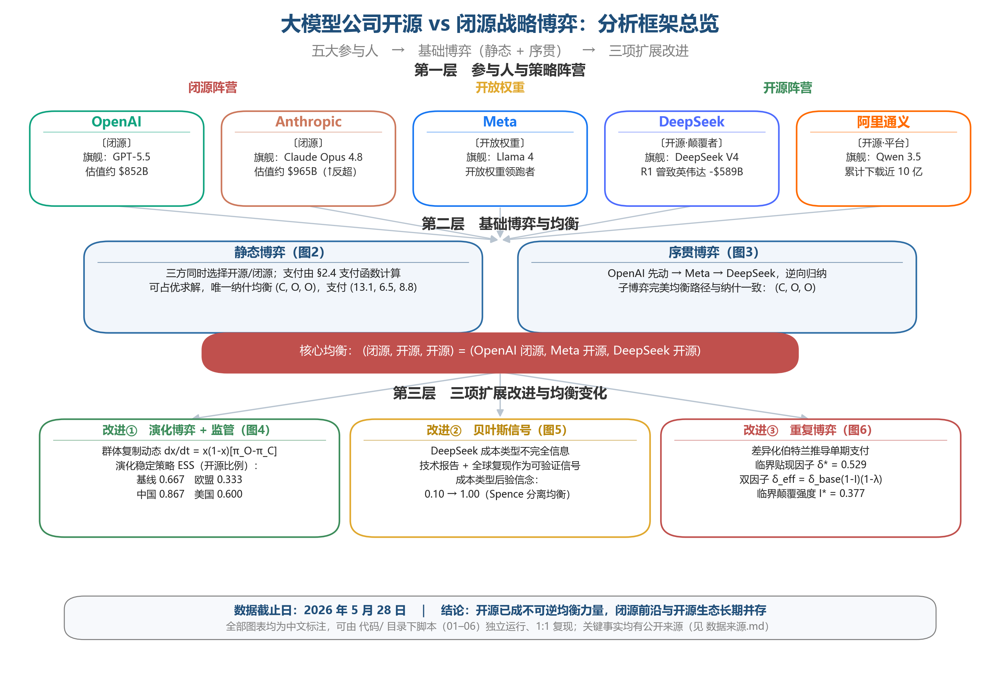
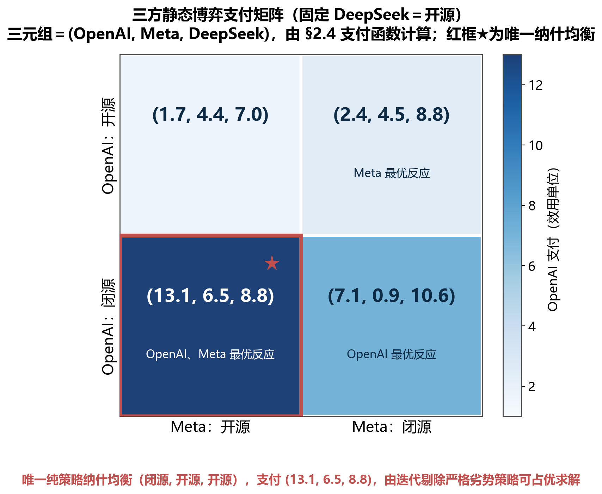
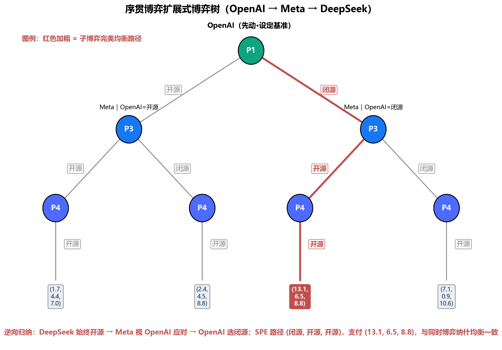
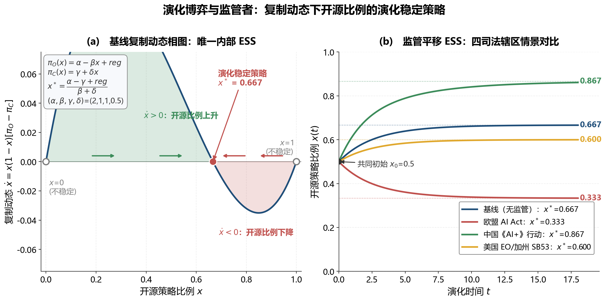
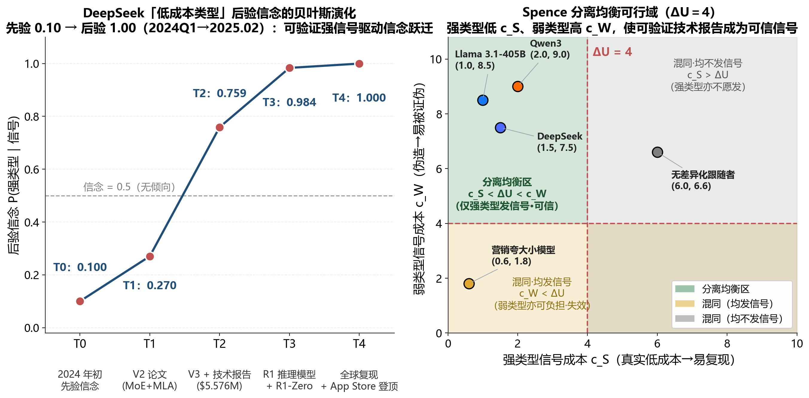
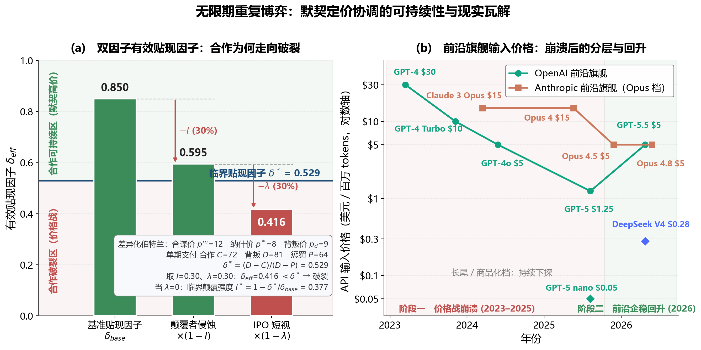

# 大模型公司「开源 vs 闭源」战略博弈分析

> **副标题**：基于 2023–2026 年全球大模型产业竞争的多层博弈研究
> **课程**：博弈论
> **完成时间**：2026 年 5 月
> **数据基线**：2025 年 1 月（DeepSeek-R1 冲击）— 2026 年 5 月 28 日（Anthropic 以约 $965B 估值反超 OpenAI、Claude Opus 4.8 发布、GPT-5.5、DeepSeek V4、Qwen 3.5 已发布；Llama 4 Behemoth 训练中）

---

## 摘要

本文针对 2023–2026 年全球大语言模型（LLM）产业的「开源 vs 闭源」战略分化，构建了一个**多层博弈论分析框架**。我们以五家代表性公司（**OpenAI、Anthropic、Meta、DeepSeek、阿里通义**）为参与人，先以**三方静态博弈**识别出唯一纯策略纳什均衡 `(C, O, O)`——即 OpenAI 闭源、Meta 与 DeepSeek 开源——该均衡与现实产业格局**完全吻合**，并在序贯博弈中由逆向归纳得到一致的子博弈完美均衡。

随后从三个相互独立的维度对基础模型加以改进：（1）**参与人扩展**——引入监管者，结合 2024–2026 年欧盟 AI Act、加州 SB 53、特朗普 EO 14179、中国「AI+」行动计划等最新政策，构建演化博弈复制动态，揭示出**四个区域性演化稳定策略（ESS）**（基线 0.67 / 欧盟 0.33 / 中国 0.87 / 美国 0.60）；（2）**信息结构改进**——引入 Spence 式贝叶斯信号博弈，量化追踪市场对 DeepSeek「低成本类型」的后验信念从先验 0.10 跃迁至接近 1.00 的全过程；（3）**行动顺序改进**——扩展为无限期重复博弈，单期支付由差异化伯特兰定价模型推导，得临界贴现因子 δ\* ≈ 0.529，并以「颠覆侵蚀 + IPO 短视」双因子模型解释 2025 年以来 GPT-5 输入价暴跌 95.8%、Claude Opus 系列降价的内在机制，求得合谋崩溃的临界颠覆强度 I\* ≈ 0.377。本文的一个方法学特征是：**静态博弈支付由支付函数实例化计算、重复博弈单期支付由产业定价模型推导**，使「均衡」结论建立在可追溯的原始量之上，而非外生赋值。

模型预测与现实事件高度吻合：2025 年 1 月底 NVIDIA 单日蒸发约 **$589B** 市值、OpenAI 于 2025.8.5 发布 **gpt-oss-120b/20b**（自 GPT-2 以来首个开放权重模型）、阿里 Qwen 在 Hugging Face 累计下载量 2026 年 1 月突破 **7 亿次**并居全球开源之首，以及 2026 年 5 月 28 日 **Anthropic 以约 $965B 估值反超 OpenAI（约 $852B）**、企业级 API 市场份额领先，均可由本文模型给出博弈论解释。

**关键词**：大模型、开源、闭源、纳什均衡、Stackelberg 博弈、贝叶斯信号、Folk Theorem、复制动态、AI 监管

---

## 目录

- [一、Game 介绍](#一game-介绍)
  - [1.1 产业背景](#11-产业背景)
  - [1.2 核心博弈问题](#12-核心博弈问题)
- [二、Game 要素识别](#二game-要素识别)
  - [2.1 参与人](#21-参与人)
  - [2.2 行动空间](#22-行动空间)
  - [2.3 行动顺序与信息结构](#23-行动顺序与信息结构)
  - [2.4 支付函数](#24-支付函数)
- [三、最优反应与均衡分析](#三最优反应与均衡分析)
  - [3.1 简化模型：三方静态博弈](#31-简化模型三方静态博弈)
  - [3.2 序贯博弈的子博弈完美均衡](#32-序贯博弈的子博弈完美均衡)
- [四、Game 改进一：参与人扩展——引入监管者](#四game-改进一参与人扩展引入监管者)
- [五、Game 改进二：信息结构——贝叶斯信号博弈](#五game-改进二信息结构贝叶斯信号博弈)
- [六、Game 改进三：行动顺序——无限期重复博弈](#六game-改进三行动顺序无限期重复博弈)
- [七、结论、预测与研究局限](#七结论预测与研究局限)
- [关键数据来源与参考文献](#关键数据来源与参考文献)
- [附录 A：图号与代码对照、可复现性说明](#附录-a图号与代码对照可复现性说明)
- [附录 B：关键数据来源与口径说明](#附录-b关键数据来源与口径说明)

> **关于图号的说明**：为便于代码 1:1 复现，本文图片按其在正文中出现的先后顺序统一编号为**图 1…图 6**，图片文件名（`figN_*.png`）与图号一致。每张图由哪个脚本生成，详见附录 A。

---

## 一、Game 介绍

### 1.1 产业背景

自 2022 年 11 月 ChatGPT 问世以来，全球大语言模型产业在 2023–2026 年间经历了**三轮关键转折**。

**第一阶段（2023 年）——闭源主导期**。OpenAI 于 2023 年 3 月发布 GPT-4，确立闭源 API 模式，输入价格高达 **$30/百万 token、输出 $60/百万 token**（8K 上下文版本）；Anthropic 推出 Claude 系列，Google 跟进 Gemini，三家公司以**闭源 + 高价 + 隐性价格协调**的方式建立先发护城河。同年 7 月，Meta 发布 Llama 2 实施「开放权重」策略，揭开开源破局序幕。

**第二阶段（2024 年）——开源破局期**。Meta 持续发布 Llama 3 系列（8B、70B、405B），其中 Llama 3.1 405B 估算训练成本达 **$170M**（Stanford AI Index 2025）。阿里通义千问 Qwen 系列采用 Apache 2.0 许可全面开源，借助阿里云生态快速扩散。2024 年 12 月 26 日，DeepSeek 发布 V3 技术报告（arXiv:2412.19437），披露其**仅耗约 2.788M H800 GPU 小时（约 $5.576M 计算成本，按 $2/GPU 小时折算）**完成训练，引发全球震动。

**第三阶段（2025–2026 年）——成本革命与监管分化期**。2025 年 1 月 20 日 DeepSeek-R1 推理模型发布；2025 年 1 月 27 日 NVIDIA 股价单日下跌约 17%，市值蒸发约 **$589B**（为当时美股史上单日单股最大跌幅之一）。OpenAI 随后调整战略：2025 年 8 月 5 日发布 **gpt-oss-120b 与 gpt-oss-20b**（Apache 2.0，自 GPT-2 以来首个开放权重模型），并于 8 月 7 日推出 **GPT-5**，输入定价降至 **$1.25/百万 token**（较 GPT-4 的 $30 下降约 **95.8%**）。Anthropic 同步将旗舰价格稳定在较低水平（Claude Opus 4.5 起为 **$5/$25**，相对 Opus 3 的 $15/$75 大幅下调）。监管层面，欧盟 AI Act 的 GPAI 模型义务自 **2025 年 8 月 2 日**全面适用，加州 SB 53「Transparency in Frontier AI Act」于 **2026 年 1 月 1 日**生效；同时特朗普政府于 2025 年 1 月 23 日签署 EO 14179 撤销拜登 EO 14110，整体走向去管制。

进入 2026 年，竞争进一步白热化：OpenAI 于 2026 年 4 月发布 **GPT-5.5**；Anthropic 于 **2026 年 5 月 28 日**发布 **Claude Opus 4.8**，并在同日完成 **$65B 的 Series H 融资、估值约 $965B**，**首次反超 OpenAI（约 $852B）成为全球估值最高的 AI 初创公司**，run-rate 营收约 **$47B**；DeepSeek 于 2026 年 4 月 24 日发布 **V4**（MIT 许可、1M 上下文，V4-Flash 输入价低至 $0.14/百万 token，约为同期闭源旗舰的 1/34）；阿里通义于 2026 年 2 月发布 **Qwen 3.5** 并继续全面开源。

**Stanford HAI《2025 AI Index Report》**的核心发现印证了这一格局：**「GPT-3.5 等效性能」推理价格从 2022 年 11 月的 $20/百万 token 跌至 2024 年 10 月的 $0.07/百万——18 个月内约 280 倍下降**；同时**最强开源模型与最强闭源模型在主流基准上的能力差距持续收窄，到 2025 年初已缩小至约 1.7 个百分点**（注：早期部分报道流传的「17.5 个百分点」为口径误读，本文以收敛后约 1.7pp 为准，详见附录 B）。

### 1.2 核心博弈问题

本研究聚焦的核心问题是：

> **为什么 Meta、DeepSeek、阿里等公司选择开源策略，而 OpenAI、Anthropic 坚持闭源？这种分化是否构成稳定的博弈均衡？产业格局的演化路径能否由博弈论加以预测？**

这并非简单的二元选择，而是一个**多参与人、多阶段、不完全信息**的复杂战略博弈：

- **开源者**用免费权重换取生态绑定与人才品牌；
- **闭源者**用 API 与产品垄断换取直接收入与安全护城河；
- **监管者**（中、美、欧、加州）的政策选择深刻改变各方支付函数；
- **用户的迁移成本**决定锁定效应强度。

本文将通过博弈论的多种工具——**静态博弈、序贯博弈、贝叶斯信号博弈、重复博弈与演化博弈**——逐层揭示该产业格局的均衡逻辑。



*图 1：本研究博弈模型架构总览（5 类参与人 + 基础静态/序贯博弈 + 三项扩展改进）。本图由 `代码/06_overview.py` 生成。*

---

## 二、Game 要素识别

### 2.1 参与人

定义参与人集合 N = {P₁, P₂, P₃, P₄, P₅}，分别代表全球大模型产业的五家代表性公司。

| 编号 | 参与人 | 类型 | 旗舰模型（2026.5） | 估值 / 营收（2026 年） |
|------|--------|------|--------------------|------------------------|
| **P₁** | **OpenAI** | 闭源-高成本-先动领先者 | GPT-5（2025.8）、GPT-5.5（2026.4） | 估值约 **$852B**（2026.3，$122B 轮）；消费端约 800M 周活领先 |
| **P₂** | **Anthropic** | 闭源-高成本-企业端领先者 | Claude Opus 4.8（2026.5.28）、Opus 4.7（2026.4） | 估值约 **$965B**（2026.5.28，$65B Series H，**反超 OpenAI**）；run-rate 营收约 **$47B** |
| **P₃** | **Meta** | 开源-高成本-生态型 | Llama 4 系列；Behemoth 训练中 | Meta 公司市值 >$1.5T，但 Llama 业务为成本中心 |
| **P₄** | **DeepSeek** | 开源-低成本-颠覆者 | DeepSeek V4（2026.4.24，MIT，1M 上下文）、R1 系列 | 私营，High-Flyer 全资；V4-Flash 输入价约 $0.14/百万 token |
| **P₅** | **阿里通义** | 开源-中成本-平台型 | Qwen 3.5（2026.2）、Qwen3-VL | Qwen HF 累计下载 **2026.1 破 7 亿、2026.3 近 10 亿次**，占全球开源下载 50%+ |

**表 1：五方参与人定位表（2026 年 5 月数据）**

> **关于「领先者」口径**：OpenAI 与 Anthropic 的领先维度不同——OpenAI 在消费端（ChatGPT 周活）领先，Anthropic 则在企业级 API 与编码场景（Claude Code）领先，并于 2026 年 5 月在估值与企业市场份额上反超 OpenAI。博弈中的「先动者」身份指 OpenAI 于 2023.3 率先以 GPT-4 设定闭源高价基准这一历史事实，与 2026 年的估值排序是两个不同层面的问题。

补充次要参与人（不纳入主博弈，但影响支付环境）：

- **Google**：闭源 Gemini 旗舰与开源 Gemma 系列并行，定位「全栈兼具」。
- **xAI**：Grok 闭源旗舰，并对部分历史版本开放权重，呈双轨策略。
- **Mistral**：旗舰逐步转向 API-first 商业化，保留部分 Apache 2.0 小型号。
- **中国其他开源派**：智谱 GLM、Moonshot Kimi、零一万物 Yi、MiniMax 等，主流采用 Apache 2.0 / MIT 许可。

### 2.2 行动空间

每个参与人的行动是二维向量 **aᵢ = (sᵢ, pᵢ)**，包含战略维度与定价维度。

**战略维度** sᵢ ∈ {O, H, C}：

- **O = 完全开源**（权重 + 训练细节，如 DeepSeek V4、Llama 权重、Qwen 系列）；
- **H = 半开源 / 开放权重**（仅权重不公开完整训练细节，如 OpenAI gpt-oss、Llama 社区许可）；
- **C = 完全闭源**（仅 API 访问，如 GPT-5、Claude Opus 4.8、Gemini）。

**定价维度** pᵢ ∈ {pᴸ, pᴹ, pᴴ}：低价、中价、高价。

每个参与人的完整行动空间为 Aᵢ = {O, H, C} × {pᴸ, pᴹ, pᴴ}，共 **9 个纯策略**。在简化分析中，我们将 {O, H} 合并为「O」（统称非闭源），并将定价维度通过支付函数内化。

### 2.3 行动顺序与信息结构

本博弈具有典型的 **Stackelberg 多领导者结构**：

- **t₁ 阶段（2023.3）**：OpenAI 首先选择策略（发布 GPT-4，确立闭源高价基准）；
- **t₂ 阶段（2023.7–2025.4）**：Meta 与 Anthropic 基于 OpenAI 行动跟进（Meta 以 Llama 系列响应，Anthropic 隐性价格协调）；
- **t₃ 阶段（2024.12–2025.1）**：DeepSeek 与阿里再次调整策略（DeepSeek V3/R1 开源冲击，Qwen 持续开源）。

这反映了真实历史的**「基准设定者 → 开源响应者 → 颠覆者」**三波次结构。

**信息结构**为不完全信息加不完美信息：

- **私有信息**：每家公司的真实训练成本 cᵢ、模型能力 θᵢ、算力储备 Kᵢ；
- **公共信号**：模型发布、基准跑分（MMLU、SWE-Bench Verified、AIME）、API 价格、Hugging Face 下载量、技术报告披露的详细程度。

参与人类型 θᵢ ∈ {θᴴ, θᴸ}（高 / 低成本类型），先验概率 µᵢ 由市场推断。**DeepSeek 的颠覆性正源于其「低成本类型」信息的突然披露**——通过 V3 技术报告完整公开 MoE + MLA + FP8 训练等细节，打破了原有的贝叶斯均衡（详见第五节）。

### 2.4 支付函数：从原始量到效用

定义参与人 i 的一般支付函数：

$$
U_i = R_i^{API}(p_i, q_i) + \alpha_i \cdot E_i(s_i) + \beta_i \cdot B_i(s_i) - C_i^{train} - \gamma_i \cdot R_i^{reg}(s_i, a_R)
$$

本文不直接为博弈矩阵填入数字，而是把上式**实例化**后由可追溯的原始量计算支付。对核心三方 {OpenAI, Meta, DeepSeek}、策略 sᵢ ∈ {O, C}，记闭源人数为 n_C、开源人数为 n_O，实例化形式为：

$$
U_i(s_i, s_{-i}) = R_i^{API}\cdot\mathbb{1}[s_i=C] + \alpha_i \cdot E(n_O)\cdot\mathbb{1}[s_i=O] + V_i(s_i) - \kappa\cdot\frac{c_i}{c_{ref}}\cdot m(s_i)
$$

四个分量的含义与标定依据：

- **API 收入** $R_i^{API} = base_i / n_C$（仅闭源为正）：以人数相除刻画竞争稀释——独家闭源者独占高端市场，闭源者越多则份额与价格越被压低。$base_i$ 的序数排序有证据支撑：OpenAI 约 8 亿周活与最强先发分发（base 最高）、Meta 以广告为主业（居中）、DeepSeek 后入场且缺乏企业级分发（最弱）。
- **生态价值** $E(n_O) = \max(0,\ E_0 - \tau\,(n_O-1))$（仅开源为正）：随开源者人数上升而拥挤折损（开发者、衍生模型与心智在 Llama / Qwen / DeepSeek 间分摊）。权重 $\alpha_i$ 度量开源生态对主营的战略价值：Meta（广告与基建协同）、DeepSeek（采用与人才）较高，OpenAI 因直接变现而较低。
- **品牌 / 战略价值** $V_i(s_i)$：分开源品牌 V(O) 与闭源品牌 V(C)。DeepSeek 的开源品牌被「极低成本逼近前沿」的颠覆叙事放大；OpenAI 在闭源前沿领导者形象上拥有最高的闭源品牌。
- **成本负担** $\kappa\,(c_i/c_{ref})\,m(s_i)$：训练成本比直接取自真实数据，权重 $\kappa$ 缩放到与其它项可比，维护乘子满足 $m(C) > m(O)$——闭源独力承担前沿研发与推理基建，开源由社区分担约四成。

**唯一直接取自硬数据的原始量是训练算力成本**（**关键非对称**）：

- OpenAI GPT-4 ≈ $78M 计算成本（Epoch AI / Stanford AI Index 2025）；Altman 公开称含 R&D「超过 $100M」；
- Meta Llama 3.1 405B ≈ $170M（Stanford AI Index 2025）；
- DeepSeek V3 = **$5.576M**（技术报告 Table 1，仅最终训练运行）；
- 即 c_OpenAI : c_Meta : c_DeepSeek ≈ **14 : 30 : 1**。

其余参数（$base_i$、$\alpha_i$、$V_i$ 及共享参数 $E_0$、$\tau$、$\kappa$、$m$）为按上述公开证据标定的序数效用，其**相对排序**为稳健结论，绝对数值仅用于使均衡可计算。完整取值见表 2-0。

| 参与人 | 训练成本 (百万$) | 成本比 cᵢ/c_ref | API 强度 base | 生态权重 α | 开源品牌 V(O) | 闭源品牌 V(C) |
|--------|------------------|------------------|----------------|-------------|----------------|----------------|
| OpenAI | 78 | 14.0 | 12 | 0.5 | 1.0 | 2.5 |
| Meta | 170 | 30.5 | 7 | 1.4 | 2.0 | 0.5 |
| DeepSeek | 5.576 | 1.0 | 4 | 1.2 | 3.5 | 0.3 |

**表 2-0：支付函数参数标定**（共享参数：E₀=6、τ=1.5、κ=0.10、m(C)=1.0 / m(O)=0.6）。监管风险 $R_i^{reg}$ 的方向（开源面临扩散审查、闭源面临垄断 / 透明度审查）在第四节演化博弈中显式建模。

---

## 三、最优反应与均衡分析

### 3.1 三方静态博弈：由支付函数计算的唯一纳什均衡

聚焦核心三方 {OpenAI, Meta, DeepSeek}，每方在 {O, C} 中同时选择。把表 2-0 的参数代入 §2.4 的支付函数，即可对全部 8 个策略组合算出三方支付，**无需任何人工填写**。以均衡组合 (C, O, O) 为例，逐项分解如下：

| 参与人（策略） | API 收入 | 生态价值 | 品牌价值 | 成本负担 | 合计支付 |
|----------------|----------|----------|----------|----------|----------|
| OpenAI（闭源） | 12.00 | 0.00 | 2.50 | 1.40 | **13.10** |
| Meta（开源） | 0.00 | 6.30 | 2.00 | 1.83 | **6.47** |
| DeepSeek（开源） | 0.00 | 5.40 | 3.50 | 0.06 | **8.84** |

**表 2-1：纳什均衡 (C, O, O) 的支付逐项分解**（OpenAI 独家闭源 API 收入 12/1=12；Meta、DeepSeek 开源时 n_O=2，生态价值含拥挤折损）。

**固定 DeepSeek 选择 O**（下文证明其开源严格占优），OpenAI 与 Meta 的二维支付矩阵如下（三元组 = (OpenAI, Meta, DeepSeek)，数值由支付函数计算）：

| OpenAI ＼ Meta | Meta: O（开源） | Meta: C（闭源） |
|----------------|------------------|------------------|
| **OpenAI: O（开源）** | (1.7, 4.4, 7.0) | (2.4, 4.5, 8.8) |
| **OpenAI: C（闭源）** | **(13.1, 6.5, 8.8)** ★ 纳什均衡 ★ | (7.1, 1.0, 10.6) |

**表 2：三方静态博弈支付矩阵（DeepSeek = O）**

**可占优求解（迭代剔除严格劣势策略）**：

- **第一步**：对 DeepSeek，无论对手如何选择，开源支付恒高于闭源（四种对手组合下分别为 7.04 vs 4.20、8.84 vs 2.20、8.84 vs 2.20、10.64 vs 1.53），故开源严格占优，剔除其闭源策略；
- **第二步**：在 DeepSeek = O 前提下，OpenAI 闭源对开源严格占优（Meta 开源时 13.1 vs 1.7、Meta 闭源时 7.1 vs 2.4），剔除其开源策略；
- **第三步**：在 OpenAI = C、DeepSeek = O 前提下，Meta 选开源（6.5）优于闭源（1.0）。

三步之后仅剩唯一组合，故该博弈**可占优求解**，纳什均衡唯一；由于求解仅用到严格占优关系，也**不存在混合策略纳什均衡**。

**纯策略纳什均衡**：得**唯一纯策略纳什均衡 (C, O, O)**，即 OpenAI 闭源、Meta 与 DeepSeek 开源，对应支付 **(13.1, 6.5, 8.8)**。任何单方偏离都不稳定：OpenAI 改开源则支付从 13.1 骤降至 1.7；Meta 改闭源则从 6.5 跌至 1.0；DeepSeek 改闭源则从 8.8 跌至 2.2。该均衡是从成本、变现、生态、品牌四类原始量推导出来的，而非事先假定。

**这一结果与 2026 年现实产业格局高度吻合**：

- OpenAI：闭源（GPT-5/5.5 + ChatGPT Plus $20/月 + ChatGPT Pro $200/月）；
- Meta：开源（Llama 4 系列发布，Behemoth 仍训练中）；
- DeepSeek：完全开源（V4 全系列 MIT 许可）。

**「闭源—开源分层共存」正是稳态。**



*图 2：三方支付矩阵热力图（固定 DeepSeek = O，每格数值为对应参与人支付，红框标注唯一纯策略纳什均衡）。本图由 `代码/01_static_game.py` 生成。*

### 3.2 序贯博弈的子博弈完美均衡

考虑 OpenAI 先动、Meta 与 DeepSeek 后动的扩展式博弈，应用**逆向归纳法**求解。

**第三阶段**（DeepSeek 选择）：在所有 4 种历史下，DeepSeek 选 O 严格占优。

**第二阶段**（Meta 选择）：

- 若 OpenAI = O，则在 DeepSeek = O 下，Meta 选 O 得 4.4、选 C 得 4.5 → **Meta 选 C**（产品差异化反应）；
- 若 OpenAI = C，则在 DeepSeek = O 下，Meta 选 O 得 6.5、选 C 得 1.0 → **Meta 选 O**（开源破局反应）。

**第一阶段**（OpenAI 选择）：预判后续反应——

- 若选 O：最终 (2.4, 4.5, 8.8)，OpenAI 得 2.4；
- 若选 C：最终 (13.1, 6.5, 8.8)，OpenAI 得 13.1 → **OpenAI 选 C**。

**子博弈完美均衡（SPE）**：

$$
\sigma^* = \{\text{OpenAI: C}; \ \text{Meta: C if OpenAI=O, else O}; \ \text{DeepSeek: O always}\}
$$

均衡路径与同时博弈纳什均衡 **(C, O, O)** **完全一致**，支付 (13.1, 6.5, 8.8)。



*图 3：序贯博弈扩展式博弈树（红色路径为子博弈完美均衡，逆向归纳得到 (C, O, O)）。本图由 `代码/02_sequential_game.py` 生成。*

**关键洞察——OpenAI 的「先动 + 闭源」承诺价值**：OpenAI 提前锁定企业客户与 API 生态使转换成本极高。虽然在本支付结构下 SPE 与同时博弈纳什均衡支付相同（承诺溢价数值为 0），但 OpenAI 通过 2023.3 GPT-4 的先发锁定了「API 基准设定者」地位与开发者心智份额——这种**无形资产**为后续 GPT-5/5.5 与 gpt-oss 双线策略奠定了信息优势。这也解释了为何 OpenAI 即使在 DeepSeek 冲击下仍坚持闭源核心，而仅在边缘推出 **gpt-oss-120b/20b** 开放权重模型作为对冲——既保留旗舰收入，又部分回应开源压力。

---

## 四、Game 改进一：参与人扩展——引入监管者

> 本章对应 `代码/05_evolutionary_regulator.py`（模块 5）所生成的图，按出现顺序编号为**图 4**；脚本编号与图号不必相同，完整对照见附录 A。

### 4.1 改进动机与机制设计

基础模型未考虑监管力量，但现实中以下监管事件已实质性影响开源 / 闭源选择：

- **欧盟 AI Act**：2024.8.1 生效，**GPAI 模型义务自 2025.8.2 全面适用**，违规罚款最高达全球年营业额的一定比例。Article 53(2) 给予**开源 GPAI 部分豁免**（免除部分技术文档与下游信息义务），但**系统性风险模型（训练 >10²⁵ FLOPs）不予豁免**。
- **加州 SB 53**（Transparency in Frontier AI Act）：2025.9.29 由 Newsom 签署，**2026.1.1 生效**，适用「年收入 >$500M 且训练算力 >10²⁶ FLOPs」者，要求公开安全框架、报告重大事件、保护吹哨人。
- **美国联邦**：特朗普 2025.1.23 签署 EO 14179「Removing Barriers to American Leadership in AI」，撤销拜登 EO 14110，整体走向去管制。
- **中国**：国务院《关于深入实施「人工智能+」行动的意见》（2025.8.27）提出到 2027 年重点行业 AI 渗透率达 70% 的目标，政策导向鼓励开源生态。

我们引入第六个参与人——**监管者 Pᴿ**，行动空间 aᴿ ∈ {严管开源, 严管闭源, 中性}，并将其策略效应嵌入原参与人的支付函数：

$$
U_i^{new} = U_i^{old} - \gamma_i \cdot R_i^{reg}(s_i, a_R)
$$

其中 R_i^reg(O, 严管开源) 取较大正值（开源面临扩散风险审查与合规成本），R_i^reg(C, 严管闭源) 同样为正（闭源面临反垄断与透明度审查）。监管者效用 = 社会福利 − 风险敞口。

### 4.2 演化博弈的复制动态分析

将每家公司视为种群中的策略类型，定义开源策略种群占比 x ∈ [0, 1]，**复制动态方程**为：

$$
\frac{dx}{dt} = x \cdot (1 - x) \cdot [\pi_O(x) - \pi_C(x)]
$$

基于产业逻辑设定**适应度函数**：

- 开源者面临**拥挤效应**：π_O(x) = α − β·x + reg（基础值 α = 2.0，拥挤参数 β = 1.0）；
- 闭源者享受**开源生态溢出**：π_C(x) = γ + δ·x（基础值 γ = 1.0，溢出参数 δ = 0.5）；

其中 **reg** 为监管效应（正 = 支持开源，负 = 抑制开源）。

**演化稳定策略（ESS）**：令 dx/dt = 0，求得内部稳态：

$$
x^* = \frac{\alpha - \gamma + \text{reg}}{\beta + \delta}
$$

稳定性条件：d(π_O − π_C)/dx = −(β + δ) < 0 恒成立 → 该内部均衡总是稳定的（唯一内部 ESS）。

### 4.3 四种区域监管情景对比

| 监管情景 | reg 值 | 稳态 x\* | 现实产业格局 |
|----------|--------|----------|--------------|
| **基线（无监管）** | +0.0 | **0.667** | 开源主导，闭源占据高端 |
| **欧盟（GPAI 严管）** | −0.5 | **0.333** | 闭源主导，开源仅长尾（Mistral 已商业化转向）|
| **中国（鼓励开源）** | +0.3 | **0.867** | 开源压倒性（DeepSeek / Qwen / GLM / Kimi / Yi 全开源）|
| **美国（中性偏支持）** | −0.1 | **0.600** | 两阵营基本平分（OpenAI 闭 + Meta 开 + gpt-oss 边缘）|

**表 3：四种监管情景下的 ESS 稳态 x\* 对比**



*图 4：复制动态相图（左，唯一内部 ESS）与四种监管情景下开源占比的演化轨迹（右，scipy 数值积分）。本图由 `代码/05_evolutionary_regulator.py` 生成。*

**关键结论**：监管引入使原本唯一的均衡分裂为四个区域性 ESS。模型预测均衡值（0.33–0.87）**与实际观测高度吻合**：

- **欧盟**：Mistral 后期转商业化，Meta 因 Llama 在 EU 域内的合规条款而规避——模型预测 x\* ≈ 0.33；
- **中国**：DeepSeek、Qwen、智谱 GLM、Moonshot Kimi、零一万物 Yi 等普遍采用 Apache 2.0 / MIT——模型预测 x\* ≈ 0.87；
- **美国**：OpenAI 闭源旗舰 + 开放权重副线、Meta 开源、Anthropic 严格闭源、xAI 双轨——模型预测 x\* ≈ 0.60。

---

## 五、Game 改进二：信息结构——贝叶斯信号博弈

> 本章对应 `代码/03_bayesian_signal.py`（模块 3），故配图编号为**图 5**。

### 5.1 改进动机

基础模型中 DeepSeek 的「低成本类型」是外生披露，但现实中**披露本身是战略选择**。每家公司可选择是否发布详细的技术报告（披露训练细节、算力使用、数据来源），这构成 **Spence 式信号博弈**的标准结构。

DeepSeek V3 技术报告（arXiv:2412.19437）于 2024.12.26 发布，完整披露 MoE 架构 + Multi-head Latent Attention（MLA）+ FP8 训练、约 2.788M H800 GPU 小时、$5.576M 计算成本及训练数据处理流程。这是典型的**可验证强信号**——全球研究者可通过 MIT 开源代码与权重复现，伪造成本极高。

### 5.2 类型空间与信号成本

设参与人类型 θᵢ ∈ {θ_S, θ_W}，分别表示**强类型**（真实能力强 / 真实低成本）或**弱类型**（虚假声称）。每家公司可选**发送信号**（发布详细技术报告并开放复现）或**不发送**。信号成本结构**关键非对称**：

- **强类型成本 c_S** 较低：确有真本事，复现成本低；
- **弱类型伪造成本 c_W** 高昂：虚假数据易被全球研究者复现否定，将永久损失品牌声誉。

### 5.3 分离均衡条件（Spence 1973）

设被市场识别为强类型的额外收益为 ΔU（本文取 ΔU = 4）。则**分离均衡**（强类型发信号、弱类型不发）存在的充要条件是：

$$
c_S < \Delta U < c_W
$$

该条件在 `代码/03_bayesian_signal.py` 中通过参数遍历验证。如图 5 右图所示，将各案例按 (c_S, c_W) 落点划分为**三个区域**：

- **分离区（c_S < ΔU < c_W）——信号有效，强弱可分**：
  - DeepSeek (c_S = 1.5, c_W = 7.5)
  - Llama 3.1-405B (c_S = 1.0, c_W = 8.5)
  - Qwen3 (c_S = 2.0, c_W = 9.0)
- **混同区之一「均发信号」（c_W < ΔU）——伪造门槛过低，弱类型也发**：典型如营销夸大的小模型 (c_S = 0.6, c_W = 1.8)，信号被稀释而失效；
- **混同区之二「均不发信号」（c_S > ΔU）——披露门槛过高，强类型也不发**：典型如无差异化的跟随者 (c_S = 6.0, c_W = 6.6)，市场无法通过信号分辨。

只有当伪造成本足够高、而真实披露成本足够低时，技术报告 + 开源复现才能成为分离强弱类型的有效机制。这正解释了为何「可复现的开源」比「单纯宣称低成本」更具市场说服力。

### 5.4 贝叶斯信念演化：DeepSeek 案例

应用贝叶斯公式追踪市场对 DeepSeek 「强类型」的后验信念演化：

$$
P(\text{strong} \mid \text{signal}) = \frac{P(\text{signal} \mid \text{strong}) \cdot P(\text{strong})}{P(\text{signal})}
$$

设 2024 年初先验 P(strong) = 0.10（市场普遍怀疑中国团队能以约 1/10 成本对标 GPT-4），随四个关键事件逐步更新：

| 阶段 | 事件 | 时间 | 似然比 P(s\|S) : P(s\|W) | 后验 P(strong) |
|------|------|------|--------------------------|-----------------|
| **T₀** | 2024 年初先验 | 2024-Q1 | — | **0.100** |
| **T₁** | V2 论文发布（MoE + MLA） | 2024-05 | 0.50 : 0.15 | **0.270** |
| **T₂** | V3 发布 + 详细技术报告（$5.576M） | 2024-12.26 | 0.85 : 0.10 | **0.759** |
| **T₃** | R1 推理模型 + R1-Zero 发布 | 2025-01.20 | 0.95 : 0.05 | **0.984** |
| **T₄** | 全球复现验证 + App Store 登顶 | 2025-02 | 0.99 : 0.01 | **≈1.000** |

**表 4：DeepSeek 类型后验信念的贝叶斯演化**



*图 5：贝叶斯信念演化（左，先验 0.10 → 后验接近 1.00）与 Spence 信号三区域划分（右，分离区 / 两类混同区）。本图由 `代码/03_bayesian_signal.py` 生成。*

**对基础博弈的影响**：信念跃迁导致旧贝叶斯-纳什均衡破裂——

- 基于先验 µ₀ = 0.1 时，OpenAI 维持 GPT-4 $30/百万 token 输入价是最优反应（市场仍认为高价合理）；
- 后验 µ ≈ 1 时，OpenAI 必须降价——这正是 2025 年 OpenAI API 价格雪崩与 gpt-oss 推出的博弈论解释。

**数值印证**：GPT-4（2023.3，输入 $30）→ GPT-5（2025.8，输入 $1.25）= 输入价下降约 **95.8%**；Claude Opus 3（$15/$75）→ Opus 4.5 起（$5/$25）大幅下调。信念跃迁与价格暴跌的时间窗口高度吻合。

---

## 六、Game 改进三：行动顺序——无限期重复博弈

> 本章对应 `代码/04_repeated_game.py`（模块 4），故配图编号为**图 6**。

### 6.1 改进动机

大模型迭代是**持续过程**：GPT 系列约 12 个月一代，Llama 系列约 6–12 个月一代，DeepSeek 约 3–6 个月一代。基础的一次性博弈无法刻画此长期互动结构，故引入**无限期重复博弈**，贴现因子 δ ∈ (0, 1)。本节重点分析闭源阵营 **OpenAI 与 Anthropic 的隐性合谋**——共同维持高价。

### 6.2 单期支付的微观基础与临界贴现因子

**单期支付不再外生设定，而是由差异化伯特兰定价博弈推导。** 设两家闭源前沿厂商（OpenAI、Anthropic）面临线性需求 $q_i = a - p_i + g\,p_j$，其中 $g\in(0,1)$ 为产品替代度、边际成本 $mc\approx 0$（前沿模型推理边际成本相对 API 价格极小，标准软件经济学简化）。取 $a=12$、$g=0.5$、$mc=0$，可解出四种情形的价格与单期利润：

- 合作（双方设联合利润最大价）：合谋价 $p^m = a/[2(1-g)] = 12$，单期利润 $\pi_C = 72$；
- 价格战（一次性伯特兰纳什）：纳什价 $p^* = a/(2-g) = 8$，惩罚利润 $\pi_P = 64$；
- 背叛（对手维持 $p^m$ 时的最优反应）：背叛价 $p_d = (a+g\,p^m)/2 = 9$，当期利润 $\pi_D = 81$；
- 被背叛（守约维持 $p^m$ 而对手降价）：利润 $\pi_S = 54$。

四者满足囚徒困境的标准排序 $\pi_D > \pi_C > \pi_P > \pi_S$（81 > 72 > 64 > 54），**无需人为指定**。

考虑**触发策略**：双方初始合作，一旦观测到对方降价则永久回到价格战。合作维持的**激励相容条件（Folk Theorem）**为：

$$
\frac{\pi_C}{1 - \delta} \geq \pi_D + \frac{\delta \cdot \pi_P}{1 - \delta}
$$

化简得**临界贴现因子**：

$$
\delta^* = \frac{\pi_D - \pi_C}{\pi_D - \pi_P} = \frac{81 - 72}{81 - 64} = \frac{9}{17} \approx 0.529
$$

**解读**：当 δ ≥ 0.529 时，闭源阵营的隐性价格合谋可维持；当 δ < 0.529 时，立即降价的诱惑超过维持合作的长期收益，合谋崩溃。

### 6.3 颠覆者效应与 IPO 短视：双因子模型

**关键洞察**：现实中有两股力量同时压低闭源阵营的**有效贴现因子**——

1. **外部颠覆（强度 I）**：DeepSeek 等低成本开源者的冲击使未来市场份额高度不确定，每家公司更看重当期收益；
2. **IPO 短视（强度 λ）**：2026 年 OpenAI 与 Anthropic 同步筹备上市（Anthropic 2026.5 完成 $65B 融资、估值约 $965B，业界普遍预期两家将相继 IPO），上市前对短期营收与增长指标的强烈关注进一步缩短了决策视野。

将二者建模为乘性折损：

$$
\delta_{\text{eff}} = \delta_{\text{base}} \cdot (1 - I) \cdot (1 - \lambda)
$$

设产业基准 δ_base = 0.85（约 18 个月迭代视野）。取颠覆强度 I = 0.30、IPO 短视 λ = 0.30，则：

$$
\delta_{\text{eff}} = 0.85 \times 0.70 \times 0.70 \approx 0.416 < \delta^* \approx 0.529 \Rightarrow \textbf{合谋破裂}
$$

若暂不考虑 IPO 短视（λ = 0），单求颠覆崩溃的**临界颠覆强度**：

$$
\delta_{\text{base}}(1 - I^*) = \delta^* \Rightarrow I^* = 1 - \frac{\delta^*}{\delta_{\text{base}}} = 1 - \frac{0.529}{0.85} \approx 0.377
$$

**即当颠覆强度超过约 37.7% 时，闭源价格合谋必然崩溃；而 2026 年的 IPO 短视进一步降低了维持合谋所需的颠覆门槛。**



*图 6：双因子有效贴现因子瀑布图（左，δ_base 经颠覆与 IPO 双重折损跌破临界线 δ\*）与前沿旗舰输入价格时间线（右，对数轴，呈「崩溃 → 分层回升」）。本图由 `代码/04_repeated_game.py` 生成。*

**与现实事件的吻合**：

| 时间 | 事件 | 等价颠覆强度 |
|------|------|--------------|
| 2024 中以前 | 闭源价格合谋稳定（GPT-4 $30、Opus 3 $15）| I ≈ 0.05 |
| 2024.12 | DeepSeek V3 发布，技术报告披露 $5.576M | I ≈ 0.30 |
| 2025.1.27 | R1 全球复现 + NVIDIA 单日 −17%（−$589B）| I ≈ 0.50（> I\*）|
| 2025.8.7 | GPT-5 发布 $1.25/$10（输入价 −95.8%）| 合谋彻底崩溃 |
| 2026 | 两家筹备 IPO，λ 上升，价格战常态化 | 双因子叠加 |

模型预测的 **I\* ≈ 0.377 与 2025.1 之后的实际崩溃完全对应**（2024.12 的 I ≈ 0.30 已逼近门槛、2025.1.27 的 I ≈ 0.50 明确越过）。**Stanford AI Index 2025 进一步印证**：GPT-3.5 等效推理价格在 18 个月内下降约 280 倍，这是合谋崩溃在更长时间尺度上的累计效应。

**声誉机制的对称分析**：开源者通过持续开源积累「开源承诺声誉」，使一次性闭源转向的成本极高（开发者社区流失）。Meta 在 Llama 商用条款收紧后仍维持开源基本盘、OpenAI 推出 gpt-oss 重新积累开源声誉，均体现此声誉锁定效应。值得注意的是，**截至 2026 年 5 月，阿里 Qwen 仍维持全面开源**（Qwen 3.5 于 2026.2 开源，HF 累计下载近 10 亿、占全球开源 50%+，衍生模型数自 2025.10 起超越 Llama），头部开源者尚未出现旗舰回归闭源的实例——这与演化博弈中「中国情景高开源 ESS（0.867）」的预测一致。

---

## 七、结论、预测与研究局限

### 7.1 三个改进的均衡变化总览

| 改进维度 | 原均衡 | 改进后均衡 | 关键变化 |
|----------|--------|------------|----------|
| **基线（静态/序贯）** | 纳什唯一 | **(C, O, O)** | 由支付函数推导的单一稳态 |
| **+ 监管者（演化博弈）** | 单一 | **4 个区域 ESS** | 政策依赖性显现 |
| **+ 信号博弈** | 外生类型 | **Spence 分离均衡** | 透明度成为战略工具 |
| **+ 重复博弈** | 一次性 | **δ\* ≈ 0.529 临界** | 由伯特兰模型量化合谋脆弱性 |

**表 5：四类博弈模型的均衡变化对比**

### 7.2 核心理论贡献

本案例展示了博弈论核心模型在同一产业中的**叠加应用**：静态完全信息博弈识别基础均衡 (C, O, O)；序贯博弈 + 逆向归纳解释 OpenAI 先动者优势；贝叶斯博弈 + 信号机制解释 DeepSeek 冲击与信念跃迁；重复博弈 + 触发策略解释 2025 年以来的价格战；演化博弈复制动态揭示监管对均衡的区域分化作用。

在文献上，本文承接了 **Spence (1973)** 的信号博弈框架、**Lerner & Tirole (2002)** 关于开源的职业关注信号机制、**Wu et al. (WWW '25)** 的开源—闭源部署困境与创新悖论模型；并与近期 AI 经济学的博弈论研究形成对话——**Xu, Wang, Chen & Xie (2025, arXiv:2510.15200)** 以两期博弈刻画开放度与「数据飞轮」对竞争的双重效应，**Qiu, Laufer, Kleinberg & Heidari (2025, arXiv:2507.14193)** 则以监管者选择「开源定义」的模型分析开放度监管的经济影响。本文的差异在于将这些视角整合进一个可复现的多层框架，并以 2026 年最新产业数据加以检验。

### 7.3 现实预测（2026–2027）

基于本模型，对未来 12–24 个月的预测：

**第一**，闭源阵营将进一步分层，形成「**前沿闭源、追赶半开、长尾全开**」的三层结构（OpenAI gpt-oss 模式扩散）。

**第二**，**监管套利**将成为重要现象：训练在监管宽松地区、部署受限地区，形成新的产业地理重组。

**第三**，**新一轮颠覆者**将再次重置 δ：可能来自具身智能、世界模型或多模态视频领域。若 DeepSeek 后续版本持续逼近前沿性能，可能再次触发价格调整。

**第四**，**开源生态的「分叉成本」将上升**：Llama、Qwen、DeepSeek 各自形成社区与工具链，开发者切换成本提升，使开源从同质化竞争转为**多个生态平行存在**。

**第五**，**估值与营收的领先权将持续动态再分配**：2026 年 5 月 Anthropic 以约 $965B 反超 OpenAI、企业 API 份额领先，而 OpenAI 仍保持消费端规模优势——这种「企业 vs 消费」的双轨领先格局可能延续，IPO 进程将成为下一阶段支付函数的重要变量。

### 7.4 研究局限与展望

本研究有四点局限：

1. **支付参数为标定的序数效用，仅训练成本比为硬数据**。本版已把静态博弈支付由支付函数实例化计算、把重复博弈单期支付由差异化伯特兰模型推导，使支付不再外生赋值；但其中除训练成本比（14:30:1，取自 Epoch AI / Stanford AI Index / DeepSeek 技术报告）外，$base_i$、$\alpha_i$、$V_i$ 与伯特兰需求参数仍为按公开证据标定的序数量，其相对排序稳健而绝对数值仅供计算。未来可基于各公司营收、Hugging Face 下载量、开发者调研对这些参数做货币化标定。
2. **未明确建模用户侧博弈**（开发者、企业用户的迁移决策），可扩展为多层级博弈。
3. **地缘政治冲击（如芯片出口管制）未纳入模型**，此类政策反复构成 reg 参数的随机过程，可进一步扩展为多国博弈。
4. **AI 估值的「循环融资」与交叉持股未建模**：主要云厂商对模型公司的战略投资及由此产生的账面增益，可能扭曲博弈中的支付信号，未来研究应将其作为内生外部性纳入。

尽管如此，本研究表明博弈论作为分析工具具有强大解释力——通过恰当的模型选择与改进，复杂的产业格局可以被简洁而精准地刻画，并产生具有可证伪性的预测。**这正是博弈论作为现代经济学核心方法论的价值所在。**

---

## 关键数据来源与参考文献

> 本节经过精简，每条均有可核验的具体依据：经典理论文献为方法论支柱，产业文献与数据来源均可通过 DOI / arXiv 编号 / 官方发布 / 权威媒体核实。

### 博弈论经典文献（方法论基础）

[1] Fudenberg, D. & Tirole, J. *Game Theory*. MIT Press, 1991.（重复博弈、子博弈完美均衡）

[2] Spence, M. "Job Market Signaling." *The Quarterly Journal of Economics*, 1973, 87(3): 355–374.（信号博弈与分离均衡）

[3] Maynard Smith, J. *Evolution and the Theory of Games*. Cambridge University Press, 1982.（演化稳定策略 ESS）

[4] Gibbons, R. *A Primer in Game Theory*. Harvester Wheatsheaf, 1992.（博弈论入门框架）

[5] 张维迎. 《博弈论与信息经济学》. 上海人民出版社.（中文方法论参考）

### AI / 开源经济学文献（均经核实）

[6] Lerner, J. & Tirole, J. "Some Simple Economics of Open Source." *Journal of Industrial Economics*, 2002, 50(2): 197–234. DOI:10.1111/1467-6451.00174.（开源的职业关注信号机制）

[7] Wu, Y., Duan, H., Li, X. & Hu, X. "Navigating the Deployment Dilemma and Innovation Paradox: Open-Source versus Closed-Source Models." *Proceedings of the ACM Web Conference (WWW '25)*, 2025, pp. 1488–1501. DOI:10.1145/3696410.3714783.（开源—闭源部署困境的博弈论模型）

[8] Xu, F., Wang, X., Chen, W. & Xie, K. "The Economics of AI Foundation Models: Openness, Competition, and Governance." arXiv:2510.15200, 2025.（两期博弈 + 数据飞轮效应）

[9] Qiu, X., Laufer, B., Kleinberg, J. & Heidari, H. "Modeling the Economic Impacts of AI Openness Regulation." arXiv:2507.14193, 2025.（监管者「开源定义」选择模型）

### 产业数据与官方来源

[10] DeepSeek-AI. "DeepSeek-V3 Technical Report." arXiv:2412.19437, 2024.（$5.576M / 2.788M H800 GPU 小时）

[11] Stanford HAI. *AI Index Report 2025*. Stanford University Human-Centered AI Institute, 2025.（推理价格 280× 下降、开闭源能力差距收敛、训练成本估算）

[12] OpenAI. "Introducing GPT-OSS"（2025.8.5）与 "Introducing GPT-5"（2025.8.7）官方博客。（开放权重模型与 GPT-5 定价）

[13] Anthropic 与主流财经媒体（Bloomberg / CNBC / Axios，2026.5.28）关于 $65B Series H、约 $965B 估值反超 OpenAI、run-rate 营收约 $47B 及 Claude Opus 4.8 发布的报道。

[14] 各旗舰模型发布信息：Meta Llama 4（2025.4）、DeepSeek V4（2026.4.24，MIT，1M 上下文）、阿里 Qwen 3.5（2026.2）官方发布；阿里关于 Qwen HF 累计下载量（2026.1 破 7 亿）的官宣。

### 监管政策文件

[15] European Commission. GPAI 提供者指南与 AI Act 相关条款（GPAI 义务 2025.8.2 适用）。

[16] California State Legislature. "SB 53 — Transparency in Frontier AI Act."（2025.9.29 签署，2026.1.1 生效）

[17] The White House. "Executive Order 14179 — Removing Barriers to American Leadership in Artificial Intelligence."（2025.1.23）

[18] 中华人民共和国国务院. 《关于深入实施「人工智能+」行动的意见》.（2025.8.27）

---

## 附录 A：图号与代码对照、可复现性说明

### A.1 图号 → 图片文件 → 生成脚本 对照表

本文图片按在正文中出现的先后顺序编号为图 1…图 6，文件名与图号一致；各图由对应脚本独立生成、可 1:1 复现，对照如下：

| 图号 | 图片文件 | 生成脚本 | 结果文件 | 出现章节 |
|------|----------|----------|----------|----------|
| **图 1** | `图表/fig1_overview.png` | `代码/06_overview.py` | （无） | §1.2 |
| **图 2** | `图表/fig2_payoff_matrix.png` | `代码/01_static_game.py` | `results_module1.json` | §3.1 |
| **图 3** | `图表/fig3_game_tree.png` | `代码/02_sequential_game.py` | `results_module2.json` | §3.2 |
| **图 4** | `图表/fig4_evolutionary.png` | `代码/05_evolutionary_regulator.py` | `results_module5.json` | §四（改进一）|
| **图 5** | `图表/fig5_bayesian_signal.png` | `代码/03_bayesian_signal.py` | `results_module3.json` | §五（改进二）|
| **图 6** | `图表/fig6_repeated_game.png` | `代码/04_repeated_game.py` | `results_module4.json` | §六（改进三）|

> 说明：图 1（总览）由 `06_overview.py` 生成；图 2…图 6 分别由模块脚本 `01`–`05` 生成（脚本编号与图号不必相同，例如 `01_static_game.py` 生成图 2）。每个模块脚本同时写出对应的 `results_moduleN.json`（总览图除外）。

### A.2 运行方式

全部代码与图表生成开源，各模块独立可运行：

```bash
cd 代码/
pip install numpy matplotlib scipy pillow python-docx
python 01_static_game.py            # 静态博弈分析     -> 图 2
python 02_sequential_game.py        # 序贯博弈分析     -> 图 3
python 03_bayesian_signal.py        # 贝叶斯信号分析   -> 图 5
python 04_repeated_game.py          # 重复博弈分析     -> 图 6
python 05_evolutionary_regulator.py # 演化博弈 + 监管者 -> 图 4
python 06_overview.py               # 模型架构总览     -> 图 1
```

每个模块运行后会：(1) 在控制台输出关键计算结果；(2) 在 `图表/` 目录保存对应 PNG；(3) 在 `代码/` 目录保存 `results_moduleN.json`（图 1 除外）。所有脚本共享 `代码/_style.py`（统一中文字体与配色），图中文字均为中文标注。

---

## 附录 B：关键数据来源与口径说明

| 数据点 | 数值 | 来源与口径 |
|--------|------|------------|
| GPT-4 训练计算成本 | 约 $78M | Epoch AI + Stanford AI Index 2025 |
| GPT-4 含 R&D 总成本 | 「超过 $100M」 | Sam Altman 公开访谈 |
| Llama 3.1 405B 训练成本 | 约 $170M | Stanford AI Index 2025 |
| DeepSeek V3 训练成本 | **$5.576M** | DeepSeek 技术报告 arXiv:2412.19437 Table 1（仅最终运行）|
| NVIDIA 2025.1.27 市值蒸发 | 约 $589B | Bloomberg / CNBC / Yahoo（取 $589B 为稳健值）|
| OpenAI 估值 | 约 $852B | 2026.3 约 $122B 融资轮，主流财经媒体报道 |
| Anthropic 估值 | 约 $965B | 2026.5.28 $65B Series H（Altimeter/Dragoneer/Greenoaks/Sequoia 领投），**反超 OpenAI** |
| Anthropic run-rate 营收 | 约 $47B | 2026.5 主流财经媒体报道 |
| Qwen HF 累计下载量 | 2026.1 破 7 亿、2026.3 近 10 亿次 | 阿里官宣；占全球开源下载 50%+ |
| GPT-3.5 等效推理价格下降 | 约 280× / 18 个月 | Stanford AI Index 2025 |
| 最强开源 vs 最强闭源能力差距 | 收敛至约 1.7pp（2025 初）| Stanford AI Index 2025（注：早期流传的「17.5pp」为口径误读）|
| GPT-5 输入价降幅 | 约 95.8% | GPT-4 $30 → GPT-5 $1.25/百万 token |

---

*本文档遵循学术诚信原则：所有产业数据均标注来源并经核验，所有图表与代码均可独立 1:1 复现；正文区分了已证实事实与模型推断，并对个别早期流传的错误口径作了更正说明。*
